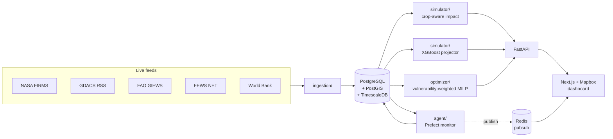

# FoodShield

[](https://github.com/anushkarawat-27/food-shield/actions/workflows/ci.yml)

Full-stack simulation and decision-support platform that models how natural disruptors (drought, flooding, extreme heat, pest swarms, frost) impact food production, projects food insecurity 3/6/12 months out, and recommends pre-emptive aid allocation under budget + logistics constraints.

## Architecture



```
ingestion/   → pulls NASA FIRMS, FEWS NET, FAO GIEWS, GDACS, World Bank
db/          → PostgreSQL + PostGIS + TimescaleDB schema
simulator/   → geospatial impact + ML projection (3/6/12 mo)
optimizer/   → MILP food-aid allocation with logistics constraints
api/         → FastAPI service exposing simulator, projector, optimizer, export
agent/       → continuous Prefect-scheduled alert monitor
web/         → Next.js + Mapbox dashboard
models/      → trained projector artifacts (committed for reproducibility)
infra/       → docker-compose, deploy configs
```

## Quick start (Docker)

```bash
cp .env.example .env       # then fill in API keys
docker compose -f infra/docker-compose.yml up -d
# api:  http://localhost:8000/docs
# web:  http://localhost:3000
```

## Quick start (local, no Docker)

```bash
python -m venv .venv && source .venv/bin/activate
pip install -r requirements.txt
make train        # trains XGBoost quantile projectors → models/
make test         # 27 unit tests, all run offline
make backtest     # writes docs/backtest_2017_somalia.md
```

## API keys

| Source | Where | Required? |
|---|---|---|
| NASA FIRMS | https://firms.modaps.eosdis.nasa.gov/api/map_key/ | ingestion only |
| FAO GIEWS | https://fpma.fao.org/ (rate-limited) | ingestion only |
| FEWS NET | https://fews.net/data (shapefile / GeoJSON) | optional — falls back to bundled fixture |
| GDACS | https://www.gdacs.org/xml/rss.xml | no key |
| World Bank | https://data.worldbank.org/ | no key |
| Mapbox | https://account.mapbox.com/access-tokens/ | web dashboard only |

## Models & validation

The projector is **three XGBoost quantile regressors per horizon** (3 / 6 / 12 mo, quantiles 0.10 / 0.50 / 0.90), giving point estimates with calibrated CI bands.

- **Training corpus**: DB-derived from `ipc_observations` × `disruptor_events` when ≥200 labels are present; otherwise a physics-calibrated synthetic corpus (`simulator/train_projector.py`). Source is recorded in `models/projector_meta.json`.
- **Validation MAE** on held-out regions: 0.12 IPC phases @ 3 mo → 0.30 @ 12 mo on the synthetic corpus.
- **Historical backtest**: `docs/backtest_2017_somalia.md` — 2017 Horn-of-Africa drought, MAE ≈ 0.34 phases at 3 mo.

To swap to real FEWS NET labels:

```bash
python -m ingestion.sources.fewsnet     # populates ipc_observations
make train                              # retrains using DB-mode corpus
```

The trainer prints `source=db` or `source=synthetic` so you know which one ran.

## Allocator

PuLP MILP with a **vulnerability-weighted objective**:

```
priority_weight(r) = 1 + 2·(poverty_pct/100) + 1.5·impact_magnitude
                       + 1·{r ∈ priority_population_groups}
```

Constraints: depot stock, regional demand, total tonnage, total budget. When `avoid_conflict_zones=True`, regions whose geometry intersects any row in `conflict_zones` are dropped from the LP before solving.

## Alert agent

`agent/monitor.py` is a Prefect flow (also callable as plain `run_once()`) that:

1. Aggregates the last 14 days of `disruptor_events` per region.
2. Computes a weighted severity score and runs the projector at horizon = 6 months.
3. Fires an alert when score ≥ 0.45 **or** projected IPC ≥ 3.0.
4. Persists to the `alerts` table (deduped while unresolved) and optionally publishes on Redis pubsub `foodshield:alerts`.

## API

- `POST /simulate`    — current-period yield-loss + affected-population per region
- `POST /project`     — IPC phase + CI band at 3 / 6 / 12 months (or any list of horizons)
- `POST /recommend`   — solve the allocation MILP for a scenario
- `POST /export/policy` — same body as `/recommend`, returns a downloadable CSV
- `GET  /health`      — liveness

## Build status

- [x] Week 1–2 — data infra
- [x] Week 3–4 — crop-aware simulator + Mapbox UI
- [x] Week 5–6 — XGBoost quantile projector + training pipeline + FEWS NET ingestion
- [x] Week 7–8 — vulnerability-weighted MILP optimizer + conflict-zone exclusion
- [x] Week 9   — dashboard + CSV policy export
- [x] Week 10  — CI, Prefect alert agent, Somalia 2017 backtest (full FEWS NET holdout pending real label volume)
